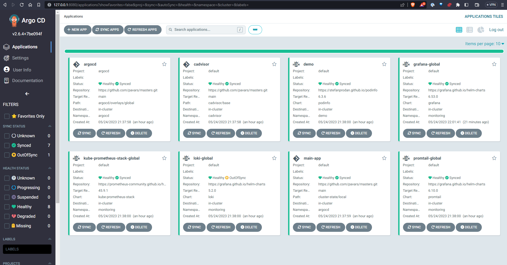

# Maģistra Darba demo

## Pre-requsites (Priekšnosacījumi)

Jābūt pieejam lokāli ieinstalētam vienam no Kubernetes klāsteriem, komandas ir izpildāmas no WSL, Linux vai MacOS operetājsistēmām.

* [Docker-Desktop](https://docs.docker.com/desktop/kubernetes/) Pārbaudīts
* [kind](https://kind.sigs.k8s.io/docs/user/quick-start/#installation) Nav pārbaudīts
* [microk8s](https://microk8s.io/docs/getting-started) Nav pārbaudīts
* [minikube](https://minikube.sigs.k8s.io/docs/start/) Nav pārbaudīts

Un

* [ArgoCD CLI](https://argo-cd.readthedocs.io/en/stable/getting_started/)

## Sistēmu pārskats

Šīs izveidotās sistēmas modelis ir uzskatāms sekojošajā augsta līmeņa shēmā, kurā tiek attēlotas galvenās sistēmas komponentes un to darbības princips.


Trivy Operator vadības paneļa piemērs no darbojošās sistēmas, kurā ir attēlotas atrastās ievainojamības


ArgoCD vadības panelis, kurā redzami objekti, kas ir sinhronizēti no github. Piebilde, šeit ir iespējams arī manuāli pievienot papildus resursu definīcijas, ja ir piekļuves tiesības.




## Running (Palaišana)

1. Noklonējam git repozitoriju un ieejam koda mapē
```bash
git clone https://github.com/pavars/masters.git && cd masters
```

2. Ieinstalējam ArgoCD resursus
```bash
# Ieinstalējam argocd (reizēm jāpalaiž divas reizes, ja CRD nav laicīgi izveidojušies)
kubectl apply -k argocd/overlays/local

# Pārbaudām instalācijas statusu (visur jābūt READY 1/1 )
kubectl get po -n argocd
# NAME                                                READY   STATUS    RESTARTS   AGE
# argocd-application-controller-0                     1/1     Running   0          103s
# argocd-applicationset-controller-6d6fc9c56b-g6nr8   1/1     Running   0          103s
# argocd-dex-server-87568f444-w87rx                   1/1     Running   0          103s
# argocd-notifications-controller-6f859d8d59-p4hnt    1/1     Running   0          103s
# argocd-redis-74d77964b-7slt5                        1/1     Running   0          103s
# argocd-repo-server-f6d876c67-ptc5q                  1/1     Running   0          103s
# argocd-server-7cd5b4d746-dfqpx                      1/1     Running   0          103s


# Iegūstam noklusējuma paroli
kubectl get secrets argocd-initial-admin-secret -o jsonpath='{.data.password}' -n argocd | base64 -d


# Ieslēdzam lokālo portu pārnešanu uz kubernetes vidi, lai piekļūtu vadības paneļiem un monitorētu statusu
# Piekļūstam lokālajai ArgoCD videi no interneta pārlūka izmantojot lietotāju admin https://127.0.0.1:8080
kubectl port-forward svc/argocd-server -n argocd 8080:443
```

3. Sinhronizējam monitoringa sistēmas un demo lietotni

```bash
# Ja ir ieinstalēts ArgoCD CLI, tad laižam sekojošo komandu, lai forsētu resursu sinhronizāciju
argocd login localhost:8080
# WARNING: server is not configured with TLS. Proceed (y/n)? y
# Username: admin
# Password: <parole no iepriekšējām komandām>
# 'admin:login' logged in successfully
# Context 'localhost:8080' updated


# Ja nav argocd cli, tad kube-prometheus-stack-global lietotni vajag sinhronizēt no ArgoCD vadības paneļa izvēloties opciju "Replace"
argocd app sync main-app
argocd app sync loki-global
argocd app sync kube-prometheus-stack-global --replace --resource apiextensions.k8s.io:CustomResourceDefinition:prometheuses.monitoring.coreos.com
# Ja šeit iegūstam Erroru, tad apturam to no komandrindas:
# FATA[0000] rpc error: code = FailedPrecondition desc = another operation is already in progress
argocd app terminate-op kube-prometheus-stack-global

# Pieliekam anotāciju prometheus resursam, lai tas turpinātu sinhronizēties
kubectl annotate crd prometheuses.monitoring.coreos.com argocd.argoproj.io/sync-options='Replace=true'

# Lai piekļūtu lokālajai Grafana instancei https://127.0.0.1:8081
kubectl port-forward svc/grafana -n monitoring 8081:80

# Iegūstam grafanas admin paroli
kubectl get secrets grafana -n monitoring -o jsonpath='{.data.admin-password}' | base64 -d
```

4. Ieslēdzam lokālo portu pārnešanu uz kubernetes vidi, lai piekļūtu vadības paneļiem
```bash
# Grafana
kubectl port-forward svc/grafana -n monitoring 8081:80
#Noderīgākie paneļi:
# Trivy Operator - Vulnerabilities
# Kubernetes Compute Resources Namespace Workloads

# Prometheus
kubectl port-forward svc/kube-prometheus-stack-prometheus -n monitoring 8082:9090

# Demo (Podinfo lietotne)
kubectl port-forward svc/demo-podinfo -n demo 8082:9898

```

## Projekta struktūra

```bash
master # Projekta mape
├── argocd # ArgoCD resursu deklarācija
│   ├── base # Kustomization pamats no kā tiek modificēts atbilstoši vajadzībām
│   │   ├── applications.yaml # Šeit tiek definētas main-app un cadvisor, kas atbild par visu pārējo resursu sinhronizēšanu
│   │   ├── argocd-cmd-params-cm-patch.yml
│   │   ├── argocd-repo-server.yaml
│   │   ├── kustomization.yaml
│   │   ├── namespace.yaml
│   │   ├── projects.yaml
│   │   └── repository.yaml
│   └── overlays # Overlayos tiek definētas izmaiņas Kustomize resursos, šajā gadījumā global definīcija
│       └── local
│           ├── argocd-app.yaml # Šeit tiek definēta argocd, kas atbild par argocd resursu sinhronizēšanu
│           ├── argocd-cm.yaml
│           ├── argocd-server-service.yaml
│           └── kustomization.yaml
├── cadvisor # Cadvisor nepieciešams tikai lokāli hostētām kubernetes instancēm, jo citādi netiek pareizi izvadītas metrikas
│   └── base # Tas nodrošina iespēju vākt metrikas no konteineriem. Kubernetes iebūvētais cadvisor lokālajā vidē izmanto Docker runtime, kas produkcijas vidē jau ir aizvietots ar containerd, lai izvadītu pareizās metrikas no iebūvētā cadvisor.
│       ├── daemonset.yaml
│       ├── kustomization.yaml
│       ├── namespace.yaml
│       ├── serviceaccount.yaml
│       ├── servicemonitor.yaml
│       └── service.yaml
├── cluster-state # ArgoCD lietotņu (Application) definīcijas
│   ├── local # lokālais kubernetes klāsteris
│   │   ├── demo # demo vide ar podinfo
│   │   │   └── podinfoA.yaml
│   │   ├── monitoring # monitoringa vide
│   │   │   ├── grafana.yaml # [Grafana helm chart](https://github.com/grafana/helm-charts/tree/main/charts/grafana)
│   │   │   ├── kube-prometheus-stack.yaml # [kube-prometheus-stack helm chart](https://github.com/prometheus-community/helm-charts/tree/main/charts/kube-prometheus-stack)
│   │   │   ├── loki.yaml # [Loki helm chart](https://github.com/grafana/loki/tree/main/production/helm/loki)
│   │   │   └── promtail.yaml # [Promtail helm chart](https://github.com/grafana/helm-charts/tree/main/charts/promtail)
│   │   └── trivy-system
│   │       └── trivy-operator.yaml # [Trivy Operator helm chart](https://github.com/aquasecurity/trivy-operator/tree/main/deploy/helm)
│   └── production # Piemēri produkcijas videi
│       └── monitoring
│           ├── grafana.yaml
│           ├── kube-prometheus-stack.yaml
│           ├── loki.yaml
│           └── promtail.yaml
└── README.md
```

## Produkcijas vidē

[Produkcijas vidē](cluster-state/production/) ir jāizmanto kāds no ingress kontrolieriem (Nginx-ingress, Traefik, Istio, Linkerd, u.c. ), kas kalpo kā reverse proxy serveris un web serveris, kas servē TLS sertifikātus, domēna vārdus, sadala ienākošu datu plūsmu atbilstošajiem servisiem, nodrošina autorizāciju. Drošības konfigurāciju web serveriem jāskatās izvēlētā rīka dokumentācijā un jānokonfigurē atbilstoši prasībām. Piemēros ir izmantots Nginx ingresa kontrolieris. Konfigurācija kalpo tikai kā piemērs.
